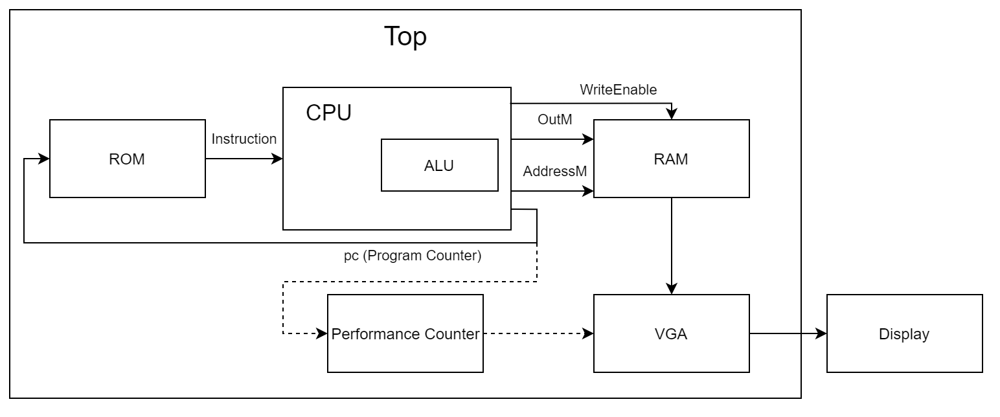

# Hack Platform

This folder contains a full implementation of the Hack platform, including a CPU, instruction ROM, RAM and a VGA controller.

## Quick Start

Install Quartus Prime Lite 17.0.

Download and open one of the premade `qar` files in the `qar` subdirectory.

Another option is to compile it from the code in this directory: 

* Make sure the project is not open in Quartus.
* Run the `switch_env.py` script to select your platform.
* Open the project in Quartus, compile it and program your device.
* Press the reset button on the device.

## Output

After programming the device, you'll see on the screen the first few words of the data memory, in binary and in hex. In the bottom of the screen you'll see a clock count (50MHz) in hex, and time count in hundreths of a second.

### Seven Segment Display

In case you don't have a screen, you can see the clock count on the 7 segment displays. Switch the rightmost switch to get the 3 least significant hex digits of the clock count. The next switch will show the next 3 digits. There are 8 digits in total. 

To avoid confusion, each switch also turns on an LED. The rightmost LED corresponds to the 3 least significant digits, the second LED corresponds to the next 3 digits, and so on.

When the CPU finishes executing the program, the leftmost LED will turn on.

## Design

The project consists of a top level module named `top`. It instanciates these major submodules:
* CPU
* Instruction ROM
* RAM
* VGA

### Block Diagram

## Run a Custom Program

The `asm` folder contains some assembly programs you can run on the CPU. You can also write your own, according to the specification of the nand2tetris course: https://www.nand2tetris.org/.

The mult32_2 program does the same as the python script at `python/mult32_2.py`. The solution of alu_test is in the Excel file `asm/alu_test.xlsx`.

In order to run a program, follow these steps:
* Download the official software suite from https://www.nand2tetris.org/software.
* Assemble your program using the assembler in the suite.
* Copy the resulting binary code into the file `memory/rom.txt`.
* Compile and program the device.

Remarks:
* The `asm` folder also contains pre-assembled code for the given programs, you don't need to assemble them yourself.
* The system halts when the CPU reaches line 4095 (the last one). Thus, you must **not** add an infinite loop to your code, or else the performance counter will not stop. Simply ensure the CPU will reach the last line.
* (TODO) Preloading the memory on the Kiwi is unsupported. Use the ISMCE.

## Your Challenge

Write your version of the CPU (and ALU) with the same functionality and interface, but better. Your CPU should execute the given program correctly and in as little clock cycles (50MHz) as possible.

You may overwrite **only** the `sv/alu.sv` and `sv/cpu.sv` files, and the PLL settings in `sv/definitions.sv`.

### PLL

To speed things up, you may increase the clock frequency using a PLL. Open the `sv/definitions.sv` file and follow the instructions there.

---
---

# TODO

Use synchoronous memory.

Create a program for the competition.

Memory preloading on the Kiwi.