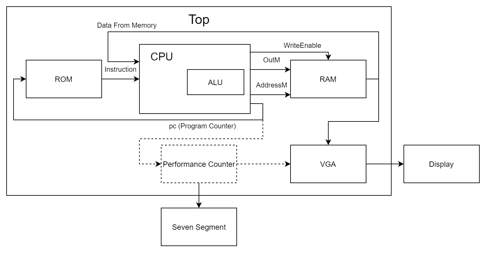
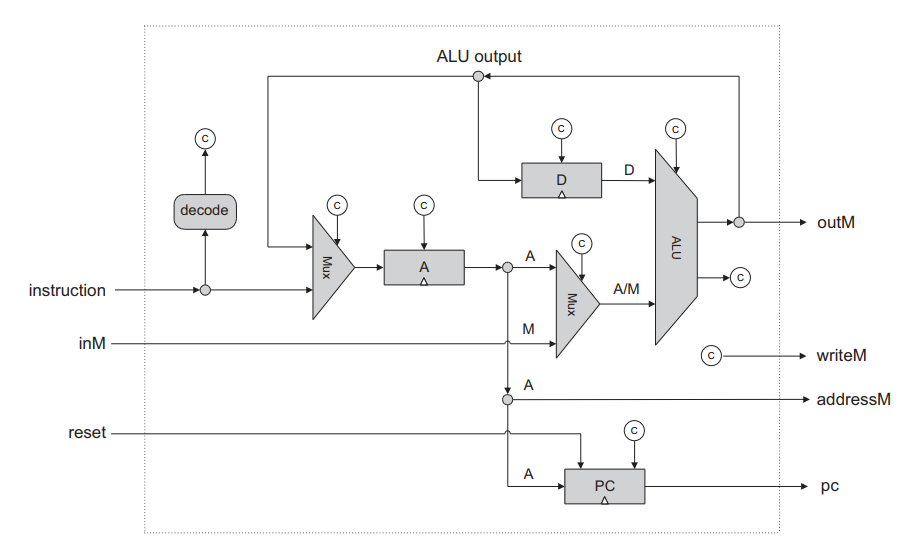

# Hack Platform

This folder contains a full implementation of the Hack platform, including a CPU, instruction ROM, RAM and a VGA controller.

## Quick Start

Install Quartus Prime Lite 17.0.

Download and open one of the premade `qar` files in the `qar` subdirectory.

Another option is to compile it from the code in this directory: 

* Make sure the project is not open in Quartus.
* Run the `switch_env.py` script to select your platform.
* Open the project in Quartus, compile it and program your device.
* Press the reset button on the device.

## Output

After programming the device, you'll see on the screen the first few words of the data memory, in binary and in hex. In the bottom of the screen you'll see a clock count (50MHz) in hex, and time count in hundreths of a second.

Note: The Kiwi will start with no program. You need to program it at runtime, which is explained below.

### Seven Segment Display

In case you don't have a screen, you can see the clock count on the 7 segment displays. Switch the rightmost switch to get the 3 least significant hex digits of the clock count. The next switch will show the next 3 digits. There are 8 digits in total. 

To avoid confusion, each switch also turns on an LED. The rightmost LED corresponds to the 3 least significant digits, the second LED corresponds to the next 3 digits, and so on.

When the CPU finishes executing the program, the leftmost LED will turn on.

## Design

The project consists of a top level module named `top`. It instantiates these major submodules:
* CPU
* Instruction ROM
* RAM
* VGA

### Computer Block Diagram



### ROM

The ROM is slightly different from the one described in the course book. It contains 4096 words, 16 bit each, and is synchronous, i.e.:
```
output(t) = ROM[address(t-1)]
```

### RAM

The RAM is also different from the course. It is the same dimensions as the ROM, and is synchronous too. Writing is defined in this way:
```
if (writeEnable(t) == 1)
    RAM[address(t)](t+1) = OutM(t)
```
The RAM is implemented in dual channel mode. The CPU interacts with the first channel only. The second channel is used for the VGA and should not concern you.

### VGA

The screen shows 12 lines, 2 words per line, begining at offset 0 in the RAM.

### CPU

The CPU's functionality is exactly as described in the nand2tetris course book. But as we decided to use synchronous RAM, input data from it will lag until the next clock cycle. To workaround this issue, the CPU stalls every second clock cycle. By stalling we mean the A, D, and PC registers are not updated. This way, when the CPU is not stalled, the input data is up to date.

The CPU block diagram, as described in the course book:



## Run a Sample Program

The `Sample Programs` folder contains some assembly programs you can run on the CPU. These programs have already been assembled for you and the assembled versions are in the `hack` folder. Intel Hex versions were also prepared for you in the `hex` folder.

The `alu_test` tests basic functions of the CPU. The expected result is in the Excel file `Sample Programs/alu_test.xlsx`.

The other programs test some basic loops and should be self-explanatory.

### DE10-Lite

If you work on the DE10-Lite, overwrite the `memory/rom.hex` file with your desired hex program. Compile the project and program the device, push the reset button (Key 0) and the program will run.

You may also write the program to the ROM in runtime. Read the next section (Kiwi) to learn how.

### Kiwi

Preloading the ROM is not supported on the Kiwi, thus the `memory/rom.hex` file is ignored. To write the program to the ROM at runtime, follow these steps:
* Compile the project and program the device as usual.
* In Quartus, open `Tools > In-System Memory Content Editor` (hereafter: "ISMCE").
* An instance named `ROM` will be found. Right click it and select `Import Data from File...`
* Select your desired `hex` file.
* Right click the instance and click `Write Data to In-System Memory`.
* Reset the device and the program will run.

## Run Your Own Program

You can also write your own programs, according to the specification of the nand2tetris course: https://www.nand2tetris.org/.

In order to run your program, you'll have to generate the hex file yourself. Follow these steps:
* Download the official software suite from https://www.nand2tetris.org/software.
* Assemble your program using the assembler in the suite.
* Copy the resulting binary code into the `hack` directory.
* Run the script at `python/hack_to_hex.py`. Your program will be converted to hex format and put in the `hex` directory. 
* Write the resulting `hex` file to the memory using the ISMCE as explained above.
* Compile the project and program the device.

Remarks:
* The system halts when the CPU reaches line 4095 (the last one). Thus, you must **not** add an infinite loop to your code, or else the performance counter will not stop. Simply ensure the CPU will reach the last line.


## Your Challenge

Write your version of the CPU (and ALU) with the same functionality and interface, but better. Your CPU should execute the given program correctly and in as little clock cycles (50MHz) as possible.

You may overwrite **only** the `sv/alu.sv` and `sv/cpu.sv` files, and the PLL settings in `sv/definitions.sv`.

Your CPU will be tested by running a program similar to `mult_32.asm`. Put your ID in the begining of both the `asm` file and in the python script at `python/mult32_2`. Convert the `asm` file to `hex` and then run the program on the CPU (as explained above). The first line on the screen should match the first line in the script output. The next non-zero line is your id in hex (which the script will show you as well).

### PLL

To speed things up, you may increase the clock frequency using a PLL. Open the `sv/definitions.sv` file and follow the instructions there.


